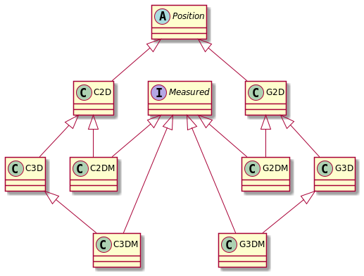

[](https://lgtm.com/projects/g/GeoLatte/geolatte-geom/context:java)
[](https://javadoc.io/doc/org.geolatte/geolatte-geom)

# Geolatte-geom

A geometry model for Java with:

* immutable data structures
* support for 2D, 3D, 2DM and 3DM geometries
* A DSL for creating Geometries
* support for several dialects of WKT/WKB (Postgis, Sql Server, SFA 1.1.0 and 1.2.1)
* Codecs for translating from/to native database formats for Postgis, Mysql, Oracle, and Microsoft SQL Server.
* Pluggable, extendable Geometry operations
* Coordinate reference system aware
* space filling curves

The library's geometry model is largely based on the
[Simple Feature Access (1.2.1) specification](https://portal.ogc.org/files/?artifact_id=25355).

GeoLatte-geom is fully interoperable with [the Java Topology Suite (JTS)](https://github.com/locationtech/jts).

# Using Geolatte-geom

Currently we require Java 1.8 or later.

The library is published on Maven Central. For Maven, you can include the following dependency.

```xml

<dependency>
    <groupId>org.geolatte</groupId>
    <artifactId>geolatte-geom</artifactId>
    <version>1.8.0</version>
</dependency>
```

# Quick start

## Creating Geometries

To create a Geometry we first need to specify the Coordinate Reference System we will be working in. Let's say we use
WGS84 (for other options, see [below](#coordinate-reference-systems)).

```java
import org.geolatte.geom.*;

import static org.geolatte.geom.crs.CoordinateReferenceSystems.WGS84;

```

The easiest way to create `Geometry` instances is by using the built-in builder DSL. This allows you to specify
2D `Position`s
(coordinates) using `c(x,y)`for Cartesian or projected coordinates, and
`g(long,lat)` for geodetic or spherical coordinates. (There are also variants for the higher dimensions).

```java
import static org.geolatte.geom.builder.DSL.*;
```

Now we can create geometries like so.

```java 
  Point<G2D> pnt=point(WGS84,g(4.33,53.21));
  
  LineString<G2D> lstr=linestring(WGS84,g(4.43,53.21),g(4.44,53.20),g(4.45,53.19));
  
  Polygon<G2D> pgn=polygon(WGS84,ring(g(4.43,53.21),g(4.44,53.22),g(4.43,53.21)));
```

We can also create Geometries in a higher-dimensional space. Let's do it in 3D.

First we again need to specify the coordinate reference system we will be working in. In this case, we derive the system
from WGS84 by adding a Vertical system for the elevation.

```java
  CoordinateReferenceSystem<G3D>  wgs84E=WGS84.addVerticalSystem(LinearUnit.METER,G3D.class);
        ...

        Point<G3D> pointWithElevation=point(wgs84E,g(4.33,53.21,350));
```

## Encoding and Decoding Geometries to WKT/WKB

Now let's write these out as WKT string.

```java
import org.geolatte.geom.codec.Wkt;
  
  String wkt=Wkt.toWkt(pnt);
          // "SRID=4326;POINT(4.33 53.21)"

          // or maybe using a specific dialect such as SFA 1.2.1
          String wktZ=Wkt.toWkt(pntWithElevation,Wkt.Dialect.SFA_1_2_1);
// "POINT Z (4.33 53.21 350)"
```

There is a very similar API for WKB encoding/decoding (see the `Wkb` codec class).

For historical and practical reasons. The default dialects for WKB/WKT are those used in [Postgis](http://postgis.org).

## Encoding and Decoding to GeoJson

See [the json module](json/README.md)

## Using Scala?

There is an experimental module for using this library in idiomatic Scala. See the [scala module](scala)

## Javadoc

The JavaDoc is [published on javadoc.io](https://javadoc.io/doc/org.geolatte/geolatte-geom).

# The Geometry model

## Positions

A `Position` is a tuple of coordinates that specify a position relative to a coordinate reference system. It corresponds
with to the concept of **direct position** in the Simple Feature and ISO-19107 specifications.

The coordinate space can be 2-, 3- or 4-dimensional. The first two dimensions are used to specify a point on the earth's
surface. The third dimension usually represent altitude or elevation, and the fourth a measurement.

There are two major types of 2D coordinate reference systems. `GeographicCoordinateReferenceSystem`s specify points on
the earth's surface using spherical coordinates (i.e. latitude and longitude).
`ProjectedCoordinateReferenceSystem`s use cartesian coordinates (x and y) on a projected plane.

From these 2D base systems we can construct higher-dimensional systems by adding a
`VerticalCoordinateReferenceSystem` for elevation and/or a `LinearCoordinateReferenceSystem` for a (user-defined)
measurement (see [below](#crs)).

Consequently, the instantiable (2D) types of `Position` are `G2D` (spherical coordinates) and `C2D` (cartesian
coordinates) in a geographic, resp. projected coordinate reference system. Subtypes of `G2D`for the higher dimensional
coordinate reference system are `G3D` (position + elevation), `G2DM` (position + measure), and `G3DM`. For `C2D` a
parallel hierarchy exists. This leads to the following class hierarchy.



## Geometry

A `Geometry` is a topologically closed set (in the mathematical sense) of `Position`s. The instantiable `Geometry`
subclasses all specify this set using one or more boundaries. The boundaries in turn are specified by interpolation
between consecutive elements in a list of `Position`s. These `Position`s are called the _vertices_ of the
`Geometry`.

A distinctive feature of this library is that `Geometry` class is parameterized by `Position` type. This means that e.g.
a `Point<C2D>` is a different type than `Point<G2D>`. This ensures that it is always explicit what the coordinates mean
(projected or spherical), and what types of operation make sense. E.g. the euclydian distance on the plane works for
projected coordinates, but makes no sense for spherical coordinates.

The instantiable subclasses of `Geometry` are:

- `Point`: a single position
- `LineString`: a 1-dimensional curve specified by linear interpolation between its vertices
- `Polygon`: a 2-dimensional space enclosed by an outer `LinearRing` (a closed `LineString`), minus the space enclosed
  by any inner `LinearRing`s.
- `MultiPoint`: a collection of `Point`s
- `MultiLineString`: a collection of `LineString`s
- `MultiPolygon`: a collection of `Polygon`s
- `GeometryCollection`: a collection of `Geometry`s

## <a name="crs"></a>Coordinate Reference Systems

For many operations a `CoordinateReferenceSystem` is required. The most important ways to create or get hold of an
`CoordinateReferenceSystem` instance is:

- Using one of the statically declared systems in the `CoordinateReferenceSystems` class (e.g. `WGS84`, `WEB_MERCATOR`)
- Find the system by its [EPSG](https://epsg.org/home.html) ID in the `CrsRepository`. The `CrsRegistry` has most of the
  coordinate reference systems in use.

As already mentioned, you can create higher-dimensional coordinate reference systems by adding a vertical or linear
system.

```java
  CoordinateReferenceSystem<C2D> crs=CrsRegistry.getProjectedCoordinateReferenceSystemForEPSG(31370);
  CoordinateReferenceSystem<C3D> crsZ=crs.addVerticalSystem(LinearUnit.METER,C3D.class);
  CoordinateReferenceSystem<C3DM> crsZM=crsZ.addLinearSystem(LinearUnit.METER,C3DM.class);
```

## Geometry operations

The [Simple Feature specification](https://portal.ogc.org/files/?artifact_id=25355) specifies a number of spatial query
and analysis operations as methods on the `Geometry` classes. From a design standpoint, declaring these operations as
methods has several drawbacks:

- Some operations need very different implementations in case of projected vs. geographic coordinate reference systems.
- It precludes the possibility of having alternative implementations for the operations with perhaps very different
  performance or correctness properties

For these reasons the spatial operations are separated into their own classes. Currently, two types are supported:

- `ProjectedGeometryOperations` : operations on projected (planar) geometries (i.e. `C2D` and subtypes)
- `MeasureGeometryOperations` : operations specific to projected (planar) geometries with a Measure (i.e. `C2DM`
  , `C3DM`)

At present there is no support for operations on geometries in a `GeographicCoordinateSystem`.

You can get hold of an operations class using the `GeometryOperations` factory class. Currently there are only default
implementations available. The `ProjectedGeometryOperations` implementation will delegate most operations to the
corresponding JTS implementation.

```java
    // example of a contains test with planar geometries
    ProjectedGeometryOperations pgo=GeometryOperations.projectedGeometryOperations();
            Point<C2D> point=point(WEB_MERCATOR,c(4.33,53.21));
        Polygon<C2D> polygon=polygon(WEB_MERCATOR,ring(c(4.43,53.21),c(4.44,53.22),c(4.43,53.21)));
        boolean isPntInPoly=pgo.contains(polygon,point);

        // example  op an operation on measured geometries
        MeasureGeometryOperations mgo=GeometryOperations.measureGeometryOperations();
        LineString<C2DM> linestring=linestring(crsM,cM(4.43,53.21,0),cM(4.44,53.20,1),cM(4.45,53.19,2));
        //create a geometry along the linestring that is between 1.5 and 1.8
        Geometry<C2DM> c2DMGeometry=mgo.locateBetween(linestring,1.5,1.8);
```

# JTS interop

Because JTS has been the dominant geometry library in the Java ecosystem, JTS interoperability has been a major concern.
The `JTS` class supports conversion from/to JTS `Geometry` instances.

```java
  import org.geolatte.geom.jts.JTS;
//Geolatte to JTS
  org.locationtech.jts.geom.Point jtsPoint=JTS.to(point(WGS84,g(4.32,53.12)));
          //.. and back
          org.geolatte.geom.Point<?> glPnt=JTS.from(jtsPoint);
        //or if you know the CRS in advance
        org.geolatte.geom.Point<G2D> glPnt2=JTS.from(jtsPoint,WGS84);
```


